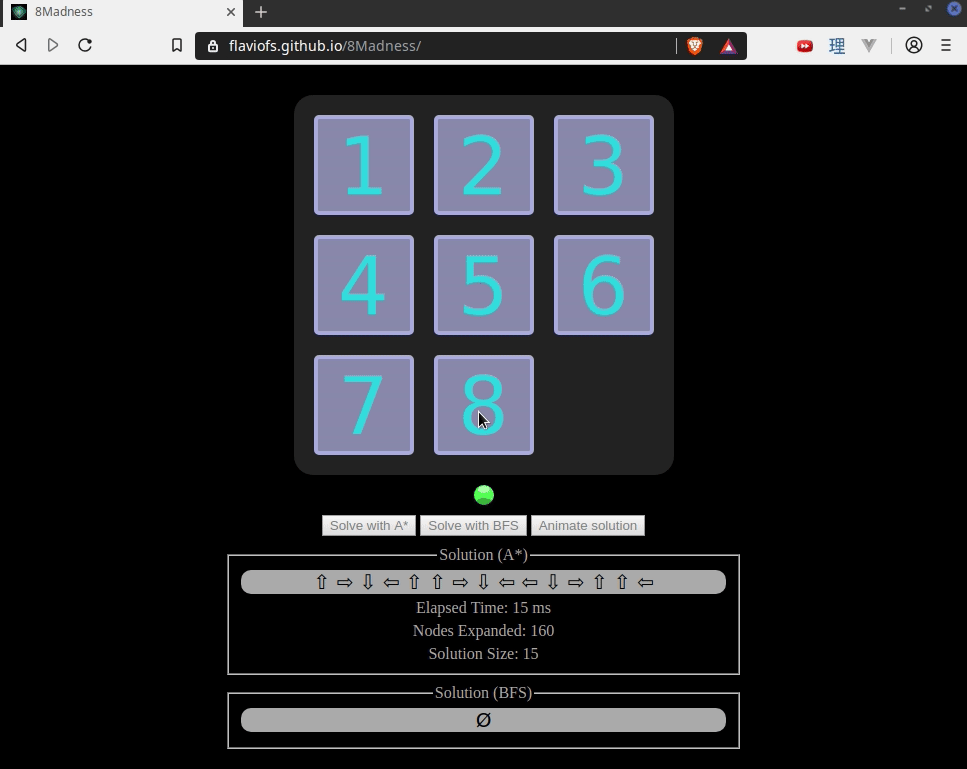

# 🤖 Artificial Intelligence Winter Class (2015)

> :warning: This repo was ported from Bitbucket!

# <a href="https://flaviofs.github.io/8Madness/" target="_blank"> Live Demo here </a>

## Description
Computer Science Bachelor's degree assignments [Aug ~ Dec 2015].

## Classes:
 - Machine Learning
 - Automated Learning

## Technology
 - Javascript
 - Implementations and solutions from scratch
 - Jquery only
 - No Bootsrap, No materials, No CSS templates or frameworks

## Contents
 - A* search
 - BFS search

## Problems solved
 - 8-piece puzzle auto-solution + animations
